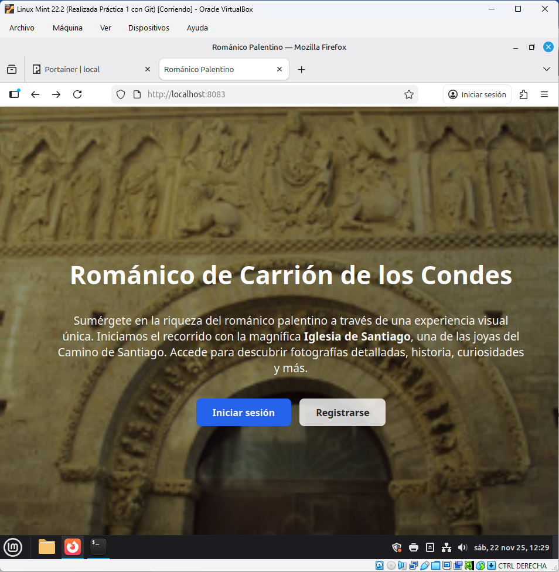
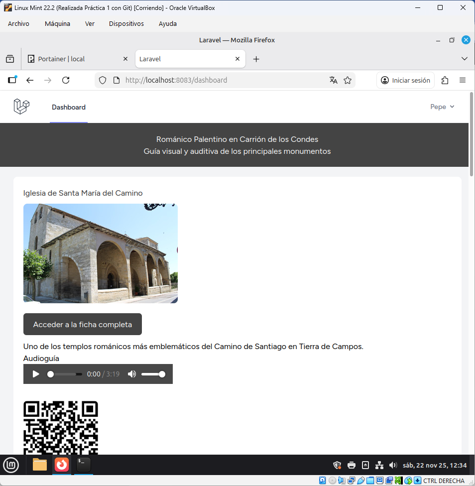
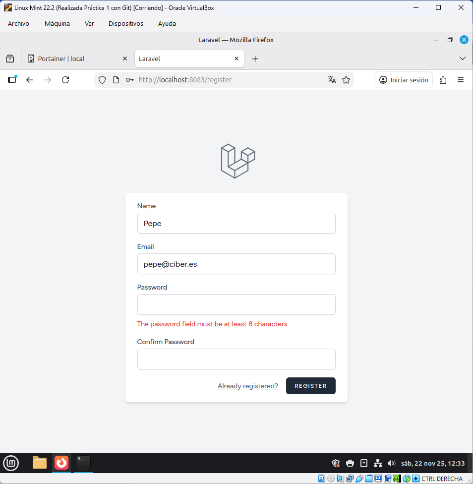

# Práctica 3 – Docker Multicontenedor: Aplicación Web Románico + Laravel

Este proyecto implementa una aplicación web basada en **Laravel**, con autenticación y contenido multimedia del **Románico Palentino**, desplegada mediante **Docker Compose** en un entorno multicontenedor.

## 🖼️ Capturas de la aplicación

<p align="center">
  
</p>
<p align="center"><em>Página de inicio</em></p>

---

<p align="center">
  
</p>
<p align="center"><em>Pantalla de inicio de sesión</em></p>

---

<p align="center">
  
</p>
<p align="center"><em>Formulario de registro</em></p>


---

## 🧱 Contenedores incluidos

El archivo `docker-compose.yml` define tres contenedores principales:

- **romanico-db** → Servidor MySQL 8.0  
- **romanico-backend** → PHP-FPM ejecutando Laravel  
- **romanico-backend-nginx** → Servidor Nginx que sirve Laravel

La aplicación está disponible en:

http://localhost:8080

---

## 🚀 Cómo desplegar la aplicación (desarrollo básico)

### 1. Clonar el repositorio

```bash
git clone https://github.com/josegarfer/docker-romanico.git
cd docker-romanico
```
### 2. Levantar el entorno
```bash
docker compose up -d --build
```
### 3. Abrir la aplicación
```bash
http://localhost:8080
```
## 📁 Estructura del proyecto
```
backend/                    → Proyecto Laravel
backend/public/romanico/    → Imágenes, audios y subpáginas del Románico
backend/resources/views/    → Vistas Blade
docker-compose.yml          → Orquestación de contenedores
```
### 🗄 Base de datos MySQL

| Parámetro     | Valor        |
|---------------|--------------|
| Host interno  | db           |
| Usuario       | romanico     |
| Contraseña    | romanico123  |
| Base de datos | romanico     |

Laravel se conecta usando estas variables en el archivo .env.

### 🏁 Release

La versión final se publica en Releases bajo el tag:
```
v1.0.0
```

Incluye todo el código necesario para desplegar la aplicación.

## 📘 Guía completa de despliegue en Debian

Esta guía resume todos los pasos necesarios para desplegar el proyecto Románico en una máquina Debian.

#### 1. Clonar el repositorio
```bash
git clone https://github.com/josegarfer/docker-romanico.git
cd docker-romanico
```
#### 2. Ajustar puertos del docker-compose.yml

Si los puertos están ocupados:
```bash
nano docker-compose.yml
```

Modificar:
backend: 9003:9000 → 900x:9000
backend-nginx: 8083:80 → 808x:80

#### 3. Crear y configurar .env
```bash
cp backend/.env.example backend/.env
nano backend/.env
```
Variables necesarias:
```bash
DB_CONNECTION=mysql
DB_HOST=db
DB_PORT=3306
DB_DATABASE=romanico
DB_USERNAME=romanico
DB_PASSWORD=romanico123
```
#### 4. Instalar dependencias y compilar assets

Como el repositorio no incluye vendor/ ni el build de frontend:
```bash
docker compose run --rm backend composer install
docker compose run --rm backend npm install
docker compose run --rm backend npm run build
```
#### 5. Levantar los contenedores
```bash
docker compose up -d
```

#### 7. Generar la APP_KEY de Laravel
```bash
docker compose exec backend php artisan key:generate
```
#### 8. Migrar la base de datos
```bash
docker compose run --rm backend php artisan migrate --force
```
#### 9. Ajustar permisos y limpiar cachés
```bash
docker compose exec backend bash -c "chown -R www-data:www-data storage bootstrap/cache"
docker compose exec backend php artisan optimize:clear
```
#### 10. Acceso final a la aplicación

En la máquina Debian:
```bash
http://<IP-DEBIAN>:8083
```

Ejemplos:

http://localhost:8083

http://192.168.1.190:8083

## ✔ Estado final

Tras completar estos pasos la aplicación queda totalmente desplegada, con:

 - Frontend compilado
 - Entorno Laravel configurado
 - Base de datos migrada
 - Cachés limpiadas
 - Permisos corregidos

Lista para su uso y para ser demostrada en entornos de prácticas.
