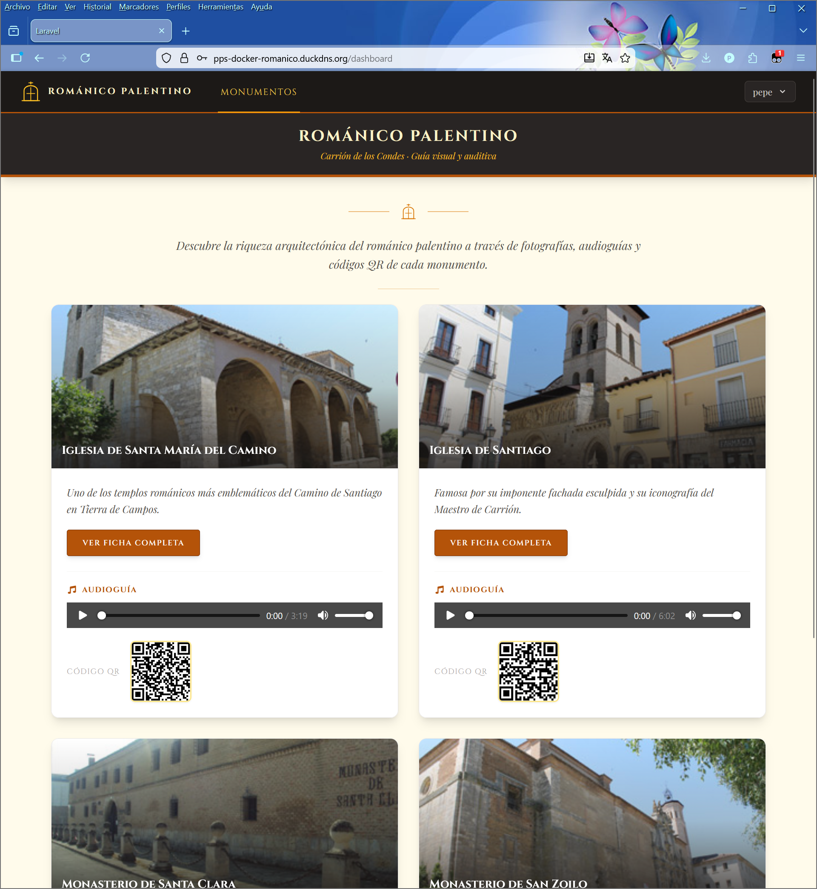

````markdown
# Práctica 3 – Docker Multicontenedor: Aplicación Románico Palentino

Este proyecto implementa una arquitectura de microservicios para una aplicación basada en **Laravel** sobre el **Románico Palentino**. El despliegue se realiza mediante **Docker Compose**, aplicando principios de segmentación de red, gestión de secretos y seguridad **Zero Trust**.

---

# 🖼️ Capturas de la aplicación

<p align="center">
  
  <br><em>Página principal con el catálogo de monumentos</em>
</p>

<p align="center">
  
  <br><em>Panel de usuario autenticado tras la migración de base de datos</em>
</p>

---

# 🧱 Arquitectura del Stack

| Servicio | Imagen | Función |
| :--- | :--- | :--- |
| **`romanico-db`** | `mysql:8.0` | Almacenamiento persistente de datos. |
| **`romanico-backend`** | `php:8.2-fpm` | Lógica de negocio y procesamiento PHP. |
| **`romanico-backend-nginx`** | `nginx:alpine` | Servidor web y entrega de contenido estático. |

---

# 🛡️ Implementación de Seguridad (Bunker Mode)

## 1. Microsegmentación de Red

Se han definido tres redes independientes para evitar el movimiento lateral de posibles amenazas:

- **`red-backyard`**:  
  Red interna exclusiva para la comunicación entre PHP y MySQL.  
  Es una red `internal` sin salida directa a internet.

- **`red-frontal`**:  
  Red de comunicación entre el servidor web Nginx y el backend PHP.

- **`proxy-public`**:  
  Red externa destinada a la integración con **Nginx Proxy Manager**.

## 2. Gestión de Secretos

Toda la configuración sensible (contraseñas de base de datos y claves de aplicación) se gestiona mediante un archivo local **`.env`**, protegido con **`.gitignore`** para evitar su publicación accidental en el repositorio.

## 3. Inmutabilidad y Solo Lectura

El contenedor de Nginx monta el código fuente en modo **Solo Lectura (`:ro`)**, reduciendo la superficie de ataque e impidiendo modificaciones desde el propio servidor web.

---

# 🚀 Despliegue e Instalación

## 1. Requisitos previos

Crear un archivo `.env` en la raíz del proyecto con el siguiente contenido:

```env
DB_ROOT_PASSWORD=una_clave_maestra_larga
DB_DATABASE=romanico
DB_USERNAME=romanico
DB_PASSWORD=una_clave_de_usuario_segura
```

## 2. Levantar el entorno

Desde la terminal, ejecutar:

```bash
docker compose up -d --build
```

## 3. Acceso a la web

### Entorno de Desarrollo (Codespaces / Local)

Acceso directo mediante el puerto publicado:

```text
http://localhost:8083
```

### Entorno de Producción (Recomendado)

Uso de un **Proxy Inverso** mediante **Nginx Proxy Manager**, apuntando al servicio:

```text
romanico-backend-nginx:80
```

> **Nota sobre puertos:**  
> Aunque la arquitectura está diseñada bajo un modelo **Zero Trust** sin exposición innecesaria de puertos, se mantiene publicado el puerto `8083` para garantizar compatibilidad inmediata con entornos de evaluación como GitHub Codespaces.

---

# 📁 Estructura del Proyecto

```text
.
├── .env                  # Secretos y contraseñas (No incluido en Git)
├── .gitignore            # Reglas de exclusión de archivos
├── docker-compose.yml    # Orquestador de la infraestructura
├── backend/              # Código fuente de Laravel
└── backend/nginx.conf    # Configuración optimizada de Nginx
```

---

# 🏁 Release y Versión

Versión estable actual:

```text
v1.2.0
```

Se han corregido los mapeos de variables de entorno para asegurar la compatibilidad completa con el motor de Laravel.

---

# 👨‍💻 Autor

**Pepe — 2026**
````
